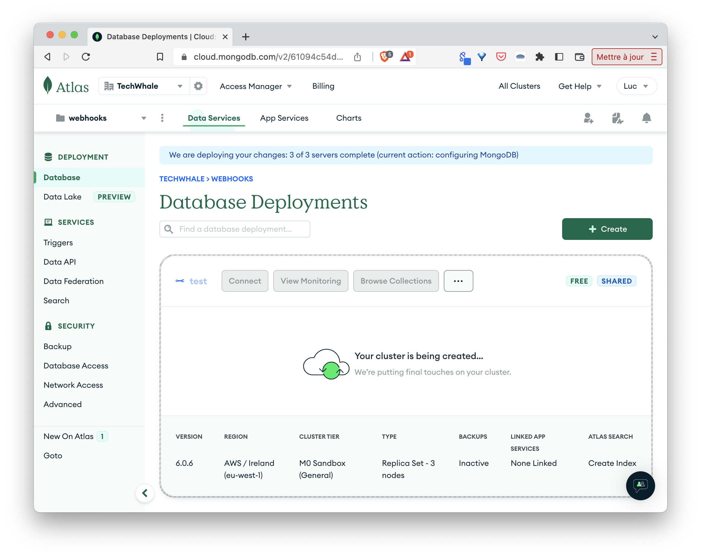
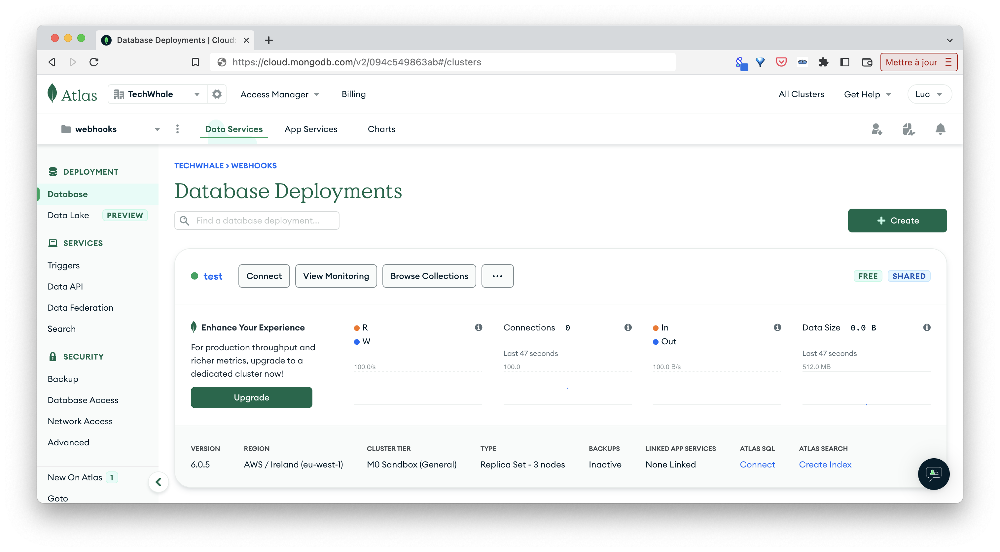

## Purpose

This folder defines an Acorn service which allows to create a Mongo Atlas cluster on the fly. 

In this very early version each cluster created by the service has the following characteristics:
- cloud provider: AWS 
- region: EU_WEST_1
- tier: M0

Notes:
- to use this service you need to have public/private api key for an Atlas organisation and the ID of a project within this org
- due to Atlas restriction, only one M0 cluster can be created in each Atlas project

## Definition of the service

The following Acornfile is the definition of the *atlas* service:

```
services: atlas: generated: job: "create-mongo-atlas-service"

jobs: "create-mongo-atlas-service": {
  image: "lucj/atlas-cli:v0.2.0"
  entrypoint: ["/bin/sh", "-c", "/render-service.sh"]
  env: {
    MONGODB_ATLAS_PUBLIC_API_KEY: "secret://atlas-creds/public_key"
    MONGODB_ATLAS_PRIVATE_API_KEY: "secret://atlas-creds/private_key"
    MONGODB_ATLAS_PROJECT_ID: "secret://atlas-creds/project_id"
    DB_USER: "secret://internal-db-creds/username"
    DB_PASS: "secret://internal-db-creds/password"
  }
  files: "/render-service.sh": """
    # Create an atlas cluster (using default properties for now)
    PROVIDER="AWS"
    REGION="EU_WEST_1"
    TIER="M0"

    # Create a cluster in the current project
    atlas cluster create test --region $REGION --provider $PROVIDER --tier $TIER

    # Wait for Atlas to provide cluster's connection string
    while true; do
      DB_ADDRESS=$(atlas cluster describe test -o json | jq .connectionStrings.standardSrv)
      echo ${DB_ADDRESS}
      if [ "${DB_ADDRESS}" = "null" ]; then
          sleep 2
      else
        break
      fi
    done

    # Allow database network access from current IP
    atlas accessList create --currentIp

    # Create db user
    atlas dbusers create atlasAdmin --username ${DB_USER} --password ${DB_PASS}

    cat > /run/secrets/output<<EOF
    services: atlas: {
      address: ${DB_ADDRESS}
      secrets: ["db-creds"]
    }
    secrets: "db-creds": {
      type: "basic"
      data: {
        username: "${DB_USER}"
        password: "${DB_PASS}"
      }
    }
  EOF
  """
}

secrets: {
  "internal-db-creds": type: "basic"

  "db-creds": {
    type: "generated"
    params: job: "create-mongo-atlas-service"
  }

  "atlas-creds": {
      external: "atlas-creds"
      type: "opaque"
      data: {
          public_key: "ATLAS_ORG_PUBLIC_KEY"
          private_key: "ATLAS_ORG_PRIVATE_KEY"
          project_id: "ATLAS_PROJECT_ID"
      }
  }
}
```

This file contains 3 top level keys:
- service (*atlas*)
- job (*create-mongo-atlas-service*)
- secrets (*internal-db-creds*, *db-creds* and *atlas-creds*)

The *atlas* service and the *db-creds* secret are both generated by the job *create-mongo-atlas-service*. This job contains all the logic to create an Atlas cluster, it uses the atlas cli binary present in the container image *lucj/atlas-cli:v0.2.0* for the creation of the cluster and of a first db user.

Note: when called from another Acorn (as we will see below) a service will provide the MongoDB URL as well as the credentials of an admin user created by the job.

The *internal-db-creds* secret is used to generated username / password on the file, those ones are provided to the job via environment variable so it can create db user.

The *atlas-creds* defines an external secret containing the credentials to connect to the Atlas account. This secret must exist in the Acorn project before the service can be used.

## Running the service

The service can be called directly from the above Acornfile.

First we need to create the secret *atlas-creds* providing the public and private keys as well as the Atlas project ID we want the MongoDB cluster to be created in:

```
acorn secrets create \
  --type opaque \
  --data public_key=$ATLAS_ORG_PUBLIC_KEY \
  --data private_key=$ATLAS_ORG_PRIVATE_KEY \
  --data project_id=$ATLAS_PROJECT_ID \
  atlas-creds
```

Next we run the Acorn:

```
acorn run -n atlas .
```

In a few tens of seconds a new Atlas cluster will be up and running.





We then delete the application:

```
acorn rm atlas --all --force
```

Also make sure to delete the cluster from the Atlas dashboard as we will create a new one below.

## Publishing the service

The idea is not to run the service from its own Acornfile but to reference the service by its name from other Acorns. For this purpose we first need to build the image of the service (as we would do for a standard Acorn application):

```
acorn build -t docker.io/lucj/acorn-atlas-service:v0.3.0 .
```

Next we push the image to an OCI registry (Docker Hub in this example):

```
acorn push docker.io/lucj/acorn-atlas-service:v0.3.0
```

Once the image is in the registry it can be used by other applications.

## Using the service

As we have done when running the service from its own Acornfile, we need to create a secret containing the atlas api keys (this secret will allow the job to connect to the Atlas account):

```
acorn secrets create \
  --type opaque \
  --data public_key=$ATLAS_ORG_PUBLIC_KEY \
  --data private_key=$ATLAS_ORG_PRIVATE_KEY \
  --data project_id=$ATLAS_PROJECT_ID \
  atlas-creds
```

### From a simple application

The following Acornfile defines 2 items:
- a reference to the *atlas* service
- a container named *app* using this service

The container only tries to connect to the database using the DB URL and the user credentials. 

```
services: atlas: {
    image: "docker.io/lucj/acorn-atlas-service:v0.3.0"
}

containers: app: {
  image: "mongo:6.0.5"
  entrypoint: ["/bin/sh", "-c", "/check-db.sh"]
  env: {
    ATLAS_CLUSTER_URL: "@{services.atlas.address}"
    ATLAS_DB_USERNAME: "@{services.atlas.secrets.db-creds.username}"
    ATLAS_DB_PASSWORD: "@{services.atlas.secrets.db-creds.password}"
  }
  files: "/check-db.sh": """
    echo "Will connect to [${ATLAS_CLUSTER_URL}] with creds [${ATLAS_DB_USERNAME} / ${ATLAS_DB_PASSWORD}]"
    while true; do
      echo "=> testing DB connection..."
      mongosh -u ${ATLAS_DB_USERNAME} -p ${ATLAS_DB_PASSWORD} --eval "db.adminCommand('ping')" ${ATLAS_CLUSTER_URL} 
      if [ $? -eq 0 ]; then
        break
      else
        sleep 5
      fi
    done
    echo "connected to the DB"
    sleep 3600
  """
}
```

This simple application can be run with the following command:

```
acorn run -n app
```

From Atlas dashboard we could see a MongoDB cluster was automatically created.
From the *app* container logs we can see the connection was successfull after the second attempt:

```
# acorn logs
? Choose an app: app
app-cf4f67d9f-9gnz2: Will connect to [mongodb+srv://test.vx27tee.mongodb.net] with creds [nckc8z9h / 8xrr5rl65xd5fw7w]
app-cf4f67d9f-9gnz2: => testing DB connection...
app-cf4f67d9f-9gnz2: Current Mongosh Log ID:    64634c5061d08aaf7f574b11
app-cf4f67d9f-9gnz2: Connecting to:             mongodb+srv://<credentials>@test.vx27tee.mongodb.net/?appName=mongosh+1.8.2
app-cf4f67d9f-9gnz2: MongoServerError: bad auth : Authentication failed.
app-cf4f67d9f-9gnz2: => testing DB connection...
app-cf4f67d9f-9gnz2: Current Mongosh Log ID:    64634c5682ba1d83d1a6e805
app-cf4f67d9f-9gnz2: Connecting to:             mongodb+srv://<credentials>@test.vx27tee.mongodb.net/?appName=mongosh+1.8.2
app-cf4f67d9f-9gnz2: Using MongoDB:             6.0.6
app-cf4f67d9f-9gnz2: Using Mongosh:             1.8.2
app-cf4f67d9f-9gnz2: 
app-cf4f67d9f-9gnz2: For mongosh info see: https://docs.mongodb.com/mongodb-shell/
app-cf4f67d9f-9gnz2: 
app-cf4f67d9f-9gnz2: 
app-cf4f67d9f-9gnz2: To help improve our products, anonymous usage data is collected and sent to MongoDB periodically (https://www.mongodb.com/legal/privacy-policy).
app-cf4f67d9f-9gnz2: You can opt-out by running the disableTelemetry() command.
app-cf4f67d9f-9gnz2: 
app-cf4f67d9f-9gnz2: { ok: 1 }
app-cf4f67d9f-9gnz2: connected to the DB
```

### From the Webhooks application

TODO