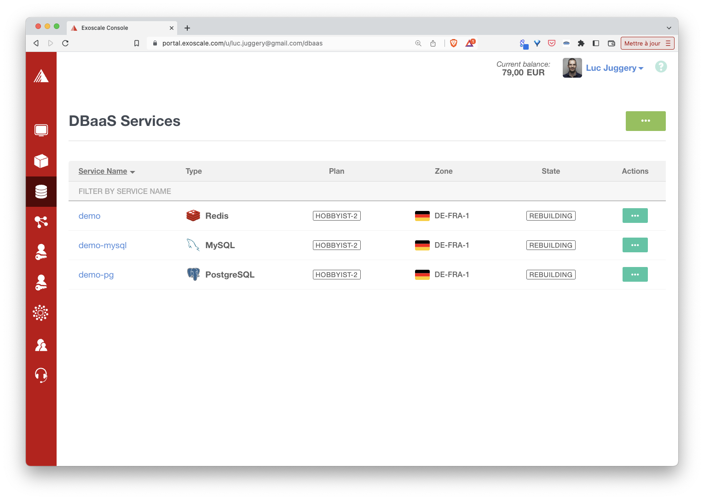
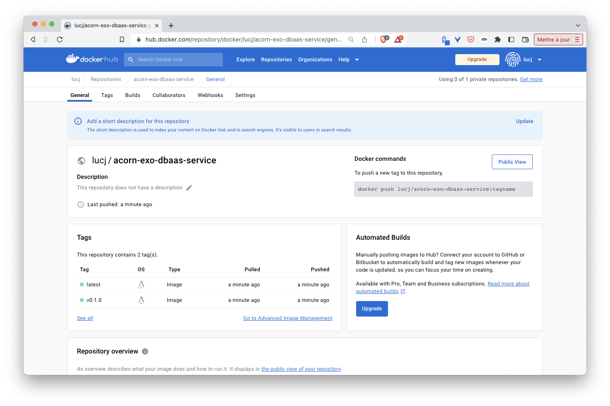

## Purpose

This folder defines an Acorn service which allows to create a database managed by the Exoscale cloud provider. This service currently creates *redis*, *postgres* or *mysql* database depending on the argument provided (more on that below).

## Prerequisites

To use this service you need to have an [Exoscale](https://exoscale.com) account and a public/private key pair with DBaaS permissions

For this demo I set those 2 keys in the following environment variables:

- EXOSCALE_API_KEY
- EXOSCALE_API_SECRET

We will use these environment variables in the next part.

## Definition of the service

The [Acornfile](./service/Acornfile) defining the service contains 4 top level keys:
- args
- service (*exo-dbaas*)
- job (*create-exo-dbaas-service*)
- secrets (*db-creds* and *exo-creds*)

The *args* key define the arguments which can be used to configure the service (type of database, plan to use, ...)

The *exo-dbaas* service is generated by the job *create-exo-dbaas-service*. This job contains all the logic to create a database managed by Exoscale. Behind the hood the database's generation process is done in a container built with this [Dockerfile](./service/Dockerfile). This container calls [render.sh](./service/render.sh) to create the database.

The *db-creds* secret is generated by the job *create-exo-dbaas-service*, it contains the credentials of the database user.

The *exo-creds* secret defines an external secret containing the credentials to connect to the Exoscale account. This secret must exist in the Acorn project before the service can be used.

## Running the service

First we need to create the secret *exo-creds* providing the public and private keys.

Note: the following example uses environment variables already defined in the current shell 

```
acorn secrets create \
  --type opaque \
  --data api_key=$EXOSCALE_API_KEY \
  --data api_secret=$EXOSCALE_API_SECRET \
  exo-creds
```

Next we run the Acorn as follows

```
acorn run -n db .
```

In a few tens of seconds a new Redis database is up and running.

By default a Redis database is launched but we could create a *Postgres* database using the argument named *--type*:

```
acorn run -n demo-pg . --name=demo-pg --type=pg
```

or a *MySQL* database with the following:

```
acorn run -n demo-mysql . --name=demo-mysql --type=mysql
```



Then we can delete the 3 applications we created

```
acorn rm db --all --force
acorn rm demo-mysql -af
acorn rm demo-pg -af
```

## Publishing the service

The idea is not to run the service from its own Acornfile but to reference the service by its name from other Acorns. For this purpose we first need to build the image of the service (as we would do for a standard Acorn application):

```
VERSION=v...
acorn build -t docker.io/lucj/acorn-exo-dbaas-service:$VERSION -t docker.io/lucj/acorn-exo-dbaas-service:latest .
```

Next we push the image to an OCI registry (Docker Hub in this example):

```
acorn push docker.io/lucj/acorn-exo-dbaas-service:$VERSION
acorn push docker.io/lucj/acorn-exo-dbaas-service:latest
```



Once the image is in the registry it can be used by other applications.

## Using the service

As we have done when running the service from its own Acornfile, we need to create a secret containing the Exoscale api keys (this secret will allow the job to connect to the Exoscale account).

Notes:
- the following example uses environment variables already defined in the current shell 
- if you have already created the secret in the previous step there is no need to run the command once again

```
acorn secrets create \
  --type opaque \
  --data api_key=$EXOSCALE_API_KEY \
  --data api_secret=$EXOSCALE_API_SECRET \
  exo-creds
```

### Using the service with a simple container

The following Acornfile defines 2 items:
- a reference to the *exo-dbaas* service
- a container named *app* using this service

The container only tries to connect to the Redis database using the URI provided in the env variable, this one is created from the service's properties: 

```
services: "exo-dbaas": {
    image: "docker.io/lucj/acorn-exo-dbaas-service"
}

containers: app: {
  image: "redis"
  entrypoint: ["/bin/sh", "-c", "/check-db.sh"]
  env: {
    URI: "@{services.redis.data.proto}://@{services.redis.secrets.db-creds.username}:@{services.redis.secrets.db-creds.password}@@{services.redis.address}:@{services.redis.port}"
  }
  files: "/check-db.sh": """
    echo "Will try to connect to [${URI}]"
    while true; do
      echo "=> testing DB connection..."
      redis-cli -u $URI ping
      if [ $? -eq 0 ]; then
        break
      else
        sleep 5
      fi
    done
    echo "connected to the DB"
    sleep 3600
  """
}
```

This simple application can be run with the following command:

```
acorn run -n app
```

Also, from the *app* container logs we can see the connection was successfull after the second attempt:

```
acorn logs app
```