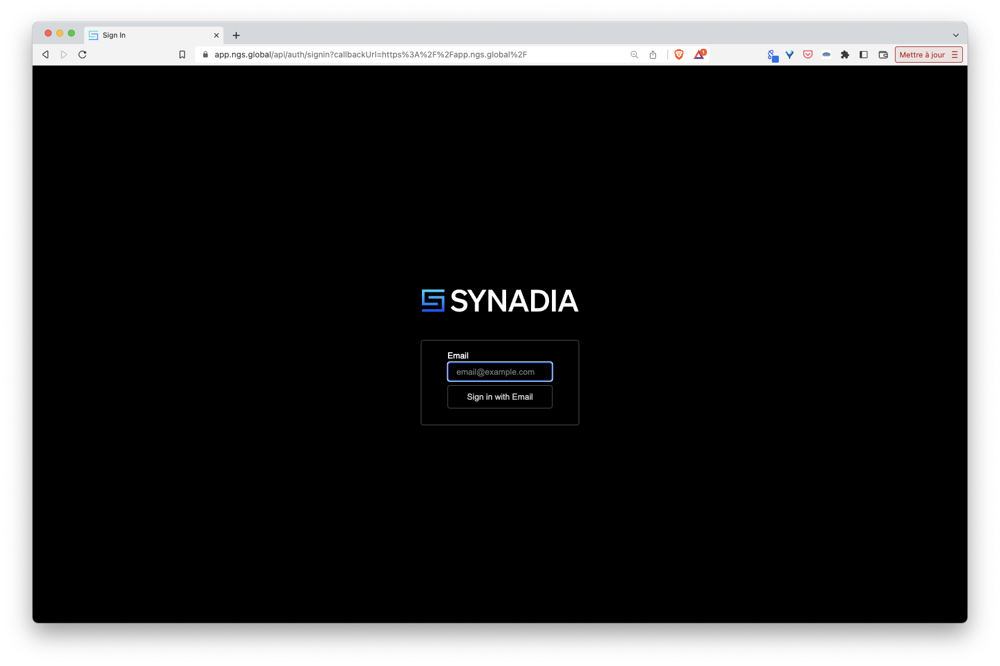
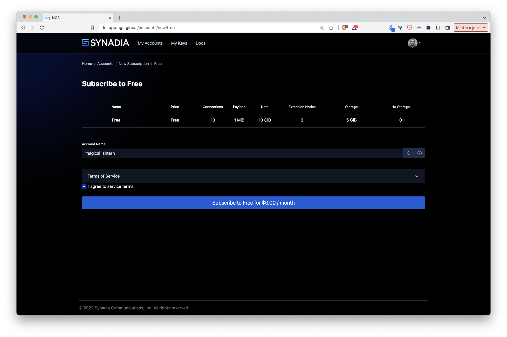
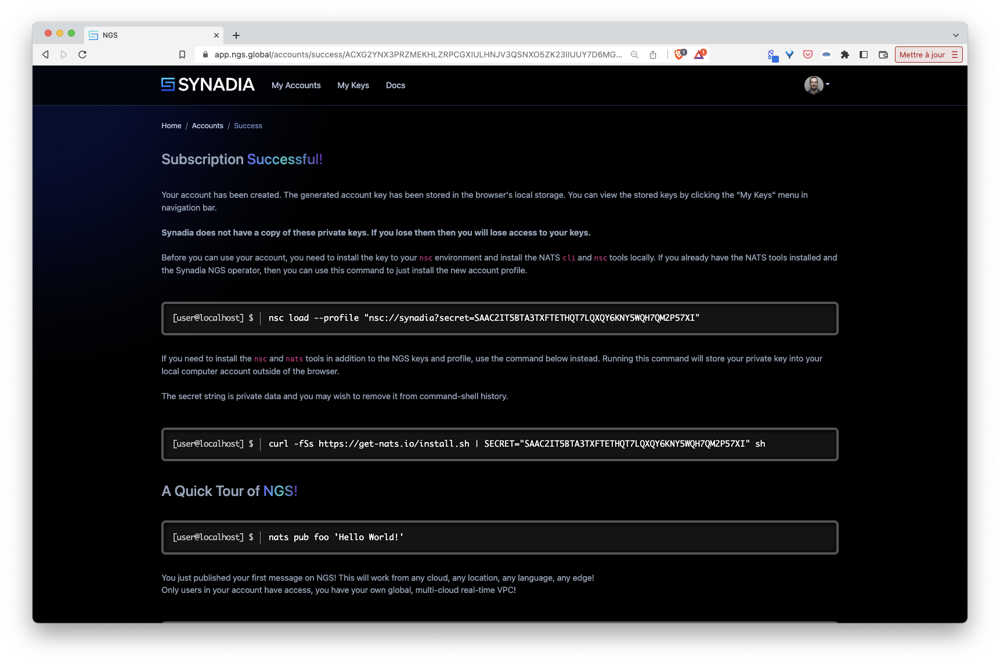
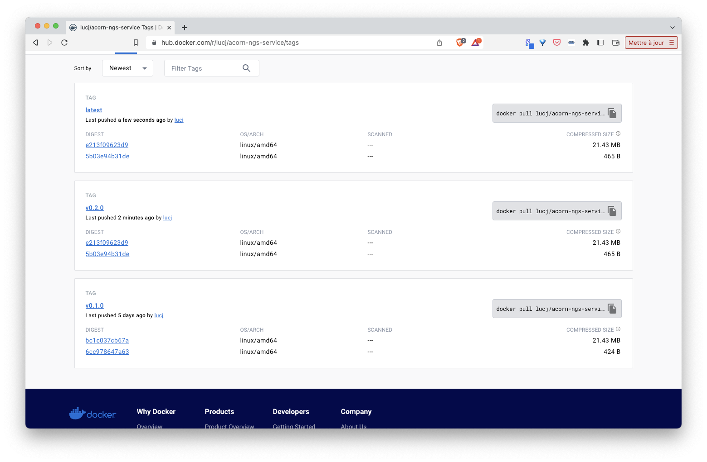

## Purpose

This folder defines an Acorn service which allows to create a NATS user on NGS on the fly

## Prerequisites

To use this service you need to have an NGS account and access to this account's private key.

First go to [https://ngs.global](https://ngs.global)


Next signin / signup



Then select a free account to start with (no credit card needed)



Then you will get the credentials to connect to this account



For this demo you can set the private key in the *NGS_KEY* environment variable on your local machine.

Note: the external key presented on the above screenshot is not an active one

## Definition of the service

The [Acornfile](./service/Acornfile) defining the service contains 3 top level keys:
- service (*ngs*)
- job (*create-ngs-service*)
- secrets (*user-creds* and *ngs-creds*)

The *ngs* service is generated by the job *create-ngs-service*. This job contains the logic to create a NGS user, it uses the ngs cli binary present in the container image *lucj/ngs-cli:v0.1.0* and generate a user credentials file.

The *user-creds* secret is generated by the job *create-ngs-service*, it contains the credentials of the ngs user.

The *ngs-creds* secret defines an external secret containing the credentials to connect to the NGS account. This secret must exist in the Acorn project before the service can be used.

## Running the service

The service can be called directly from the above Acornfile.

First we need to create the secret *ngs-creds* providing our account's private keys.

Note: the following example uses the *NGS_KEY* environment variable already defined in the current shell 

```
acorn secrets create \
  --type opaque \
  --data private_key=$NGS_KEY \
  ngs-creds
```

Next we run the Acorn:

```
acorn run -n ngs .
```

In a few tens of seconds a new user will be created in the current NGS account (the one identified with the NGS_KEY).

Running the service directly was just a test to ensure a NGS user is actually created from this service.

Then we can delete the application, this will delete the associated user.

```
acorn rm ngs -af
```

## Publishing the service

The idea is not to run the service from its own Acornfile but to reference the service by its name from other Acorns. For this purpose we first need to build the image of the service (as we would do for a standard Acorn application):

```
VERSION=v...
acorn build -t docker.io/lucj/acorn-ngs-service:$VERSION -t docker.io/lucj/acorn-ngs-service:latest .
```

Next we push the image to an OCI registry (Docker Hub in this example):

```
VERSION=...
acorn push docker.io/lucj/acorn-ngs-service:$VERSION
acorn push docker.io/lucj/acorn-ngs-service:latest
```



Once the image is in the registry it can be used by other applications.

## Using the service

As we have done when running the service from its own Acornfile, we need to create a secret containing the ngs's account key (this secret will allow the job to connect to the NGS account).

Notes:
- the following example uses environment variables already defined in the current shell 
- if you have already created the secret in the previous step there is no need to run the command once again

```
acorn secrets create \
  --type opaque \
  --data private_key=$NGS_KEY \
  ngs-creds
```

### Using the NGS service with a simple container

The following Acornfile defines 2 items:
- a reference to the *ngs* service
- a container named *app* using this service

The container only tries to connect to NGS using the user credentials  provided in the env variable, this one is created from the service's properties: 

```
services: ngs: {
    image: "docker.io/lucj/acorn-ngs-service"
}

containers: app: {
  image: "wallyqs/nats-box"
  entrypoint: ["/bin/sh", "-c", "/echo.sh"]
  files: {
    "/demo.creds": "@{services.ngs.secrets.user-creds.creds}"
  }
  files: "/echo.sh": """
    while true; do
      echo "=> sending request to ngs.echo server..."
      nats --creds /demo.creds req ngs.echo 'You out there NGS Echo service?'
      sleep 30
    done
  """
}
```

This simple application can be run with the following command:

```
acorn run -n app
```

Also, from the *app* container can publish payload and receive a reply every couple of seconds.